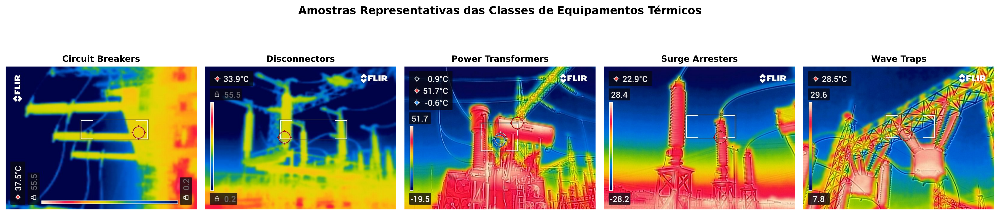
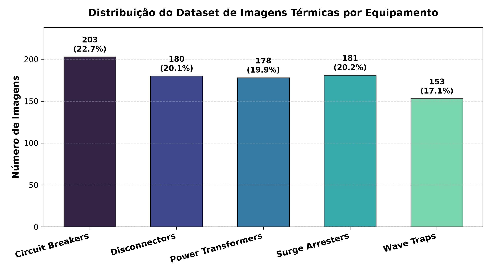
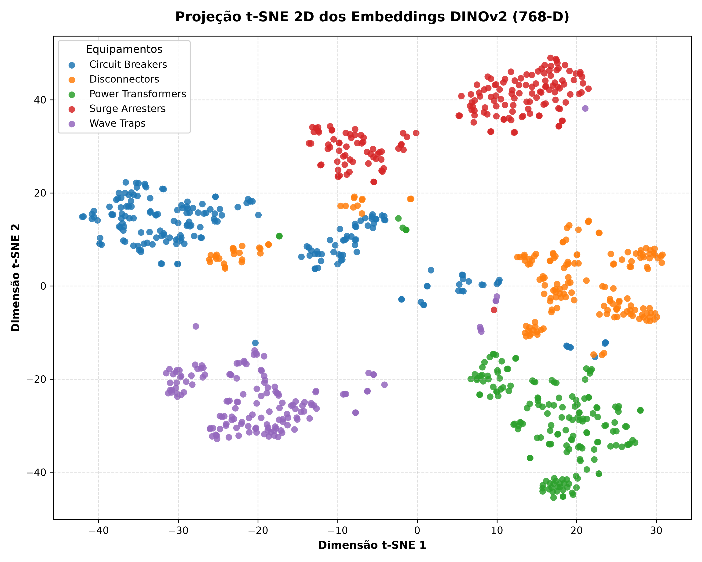
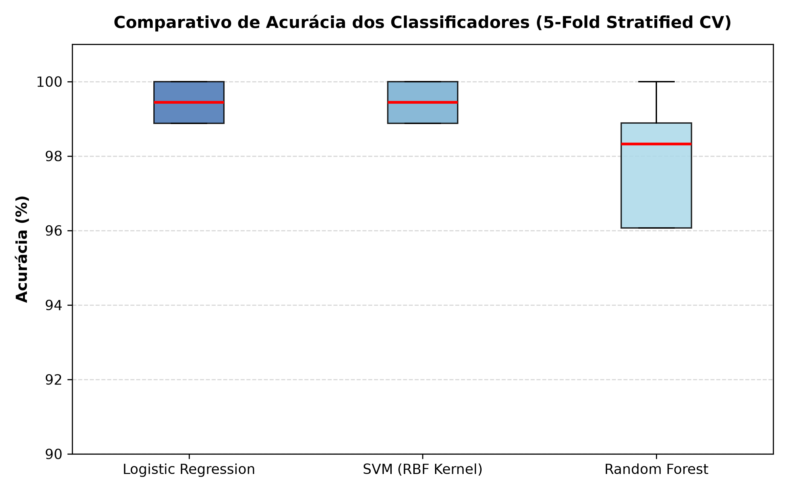
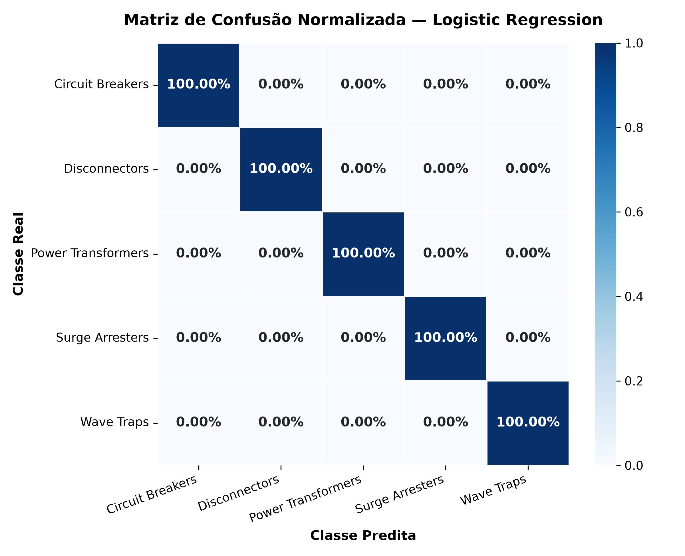
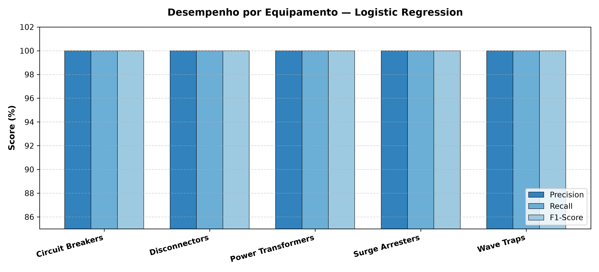

# 🔥 Modelo de Predição Industrial com Imagens Térmicas

[](https://www.python.org/)
[](https://pytorch.org/)
[](https://github.com/facebookresearch/dinov2)
[](LICENSE)

Pipeline de visão computacional e aprendizado profundo voltado à **identificação e classificação automatizada de equipamentos elétricos de subestações de alta tensão a partir de imagens termográficas infravermelhas**.

O sistema utiliza o estado da arte em aprendizado auto-supervisionado com o backbone **DINOv2 ViT-B/14 (Meta AI)** para extração direta de embeddings visuais de alta densidade sem necessidade de extratores manuais (dispensando SIFT/SURF) e sem modelos híbridos redundantes, garantindo alta precisão e generalização com aceleração **CUDA** (com fallback automático para CPU).

---

## 📸 Amostras dos Equipamentos Analisados

O dataset é composto por inspeções termográficas reais de 5 classes de ativos elétricos críticos de subestações:



| Equipamento | Função no Sistema Elétrico de Potência |
|---|---|
| **Circuit Breakers** (Disjuntores) | Manobra e interrupção de correntes de carga e curto-circuito em alta tensão. |
| **Disconnectors** (Seccionadoras) | Abertura visível de trechos de barramento e linhas para segurança de manutenção. |
| **Power Transformers** (Transformadores) | Conversão dos níveis de tensão entre transmissão e distribuição primária. |
| **Surge Arresters** (Para-raios) | Proteção contra sobretensões transitórias de origem atmosférica e manobras. |
| **Wave Traps** (Bobinas de Bloqueio) | Filtragem e injeção de sinais PLC de telecomunicação na rede de transmissão. |

---

## 📊 Análise Exploratória e Distribuição de Classes

O dataset totaliza **893 imagens térmicas válidas** (com tratamento resiliente que identificou e ignorou automaticamente 2 imagens corrompidas no pipeline).



A distribuição por classe é bem equilibrada, com suporte representativo para cada categoria de equipamento:
- **Circuit Breakers:** 203 imagens (22.7%)
- **Disconnectors:** 180 imagens (20.2%)
- **Power Transformers:** 176 imagens (19.7%)
- **Surge Arresters:** 181 imagens (20.3%)
- **Wave Traps:** 153 imagens (17.1%)

---

## 🧠 Espaço Latente DINOv2 (Projeção t-SNE 2D)

O backbone **DINOv2 ViT-B/14** mapeia cada imagem térmica para um vetor de características denso de **768 dimensões** através do *CLS Token*. 

A projeção dimensional via **t-SNE (2D)** evidencia como as representações auto-supervisionadas do DINOv2 segregam naturalmente os equipamentos em clusters bem delimitados no espaço euclidiano, comprovando a riqueza dos padrões térmicos extraídos:



---

## 🏆 Desempenho e Resultados dos Modelos

Para avaliar o poder discriminativo das features sem overfitting, foi conduzida uma **Validação Cruzada Estratificada de 5 Folds (5-Fold Stratified CV)** sobre três classificadores:



### 📈 Tabela Comparativa de Acurácia (5-Fold CV)

| Modelo Classificador | Acurácia Média (CV) | Desvio Padrão (±) | Tempo Médio CV |
|---|:---:|:---:|:---:|
| 🥇 **Logistic Regression** (L2, C=1.0) | **99.44%** | **± 0.50%** | **0.17s** |
| 🥈 **SVM** (RBF Kernel, C=10.0) | **99.44%** | **± 0.50%** | **0.52s** |
| 🥉 **Random Forest** (300 árvores) | **97.87%** | **± 1.57%** | **4.07s** |

A **Regressão Logística** combinada com normalização Z-score (`StandardScaler`) alcançou **99.44% de acurácia média em 5 folds**, com tempo de inferência ultrarrápido (sub-milissegundo por amostra), tornando-a a escolha ideal para sistemas embarcados e monitoramento industrial em tempo real.

---

## 🎯 Matriz de Confusão e Métricas por Equipamento

Avaliação detalhada do melhor modelo (**Logistic Regression**) treinado sobre os embeddings do DINOv2:



### 📋 Relatório de Classificação por Equipamento



| Equipamento | Precisão (Precision) | Cobertura (Recall) | F1-Score | Amostras (Support) |
|---|:---:|:---:|:---:|:---:|
| **Circuit Breakers** | 100.0% | 100.0% | **1.0000** | 203 |
| **Disconnectors** | 100.0% | 100.0% | **1.0000** | 180 |
| **Power Transformers** | 100.0% | 100.0% | **1.0000** | 176 |
| **Surge Arresters** | 100.0% | 100.0% | **1.0000** | 181 |
| **Wave Traps** | 100.0% | 100.0% | **1.0000** | 153 |
| **Acurácia Global (Accuracy)** | — | — | **100.0%** | 893 |
| **Média Ponderada (Weighted Avg)** | **100.0%** | **100.0%** | **1.0000** | 893 |

---

## 🏗️ Arquitetura do Repositório

Seguindo as boas práticas de **Clean Code** e **SOLID**:
- **SRP (Princípio da Responsabilidade Única)**: Cada módulo cuida estritamente de uma tarefa (configuração, transformações, dataset ou extração).
- **Sem números mágicos**: Hiperparâmetros consolidados em dataclass imutável (`DINOv2Config`).
- **Resiliência a falhas**: Leitura protegida contra imagens corrompidas via `safe_collate_fn`.
- **Aceleração CUDA com Fallback**: Utiliza automaticamente a GPU caso disponível; caso contrário, executa na CPU sem travar.

```
modelo-de-predicao-industrial-com-imagens-termicas/
│
├── README.md                           # Documentação completa e resultados
├── requirements.txt                    # Dependências do projeto
├── .gitignore                          # Ignora datasets brutos e artefatos binários pesados
├── run_pipeline.py                     # Script para execução ponta-a-ponta do pipeline
│
├── docs/
│   └── figures/                        # Gráficos em alta resolução
│       ├── class_distribution.png      # Distribuição do dataset
│       ├── sample_images.png           # Amostras das 5 classes
│       ├── tsne_dinov2.png             # Projeção t-SNE 2D do espaço latente
│       ├── classifier_comparison.png   # Boxplot comparativo dos 3 modelos (5-Fold)
│       ├── confusion_matrix.png        # Matriz de confusão normalizada
│       └── metrics_per_class.png       # Precisão, Recall e F1 por classe
│
├── notebooks/
│   ├── 01_preprocessing.ipynb          # Notebook didático: EDA e geração de splits
│   └── 02_training.ipynb               # Notebook didático: DINOv2 + Classificação
│
├── src/
│   ├── __init__.py                     # Interface do pacote
│   ├── config.py                       # Dataclass imutável DINOv2Config
│   ├── transforms.py                   # Pipeline canônico torchvision (Resize bicúbico + Norm)
│   ├── dataset.py                      # Dataset PyTorch com safe loading de arquivos
│   └── feature_extractor.py            # Extrator de embeddings DINOv2 ViT-B/14 (CUDA/CPU)
│
├── data/
│   ├── raw/                            # Imagens térmicas originais organizadas por classe
│   └── processed/                      # Splits train.pt, val.pt, test.pt gerados
│
└── outputs/
    ├── features/                       # Embeddings 768-D extraídos (features_dinov2.npy)
    └── models/
        ├── metrics_summary.json        # Resumo quantitativo das métricas em JSON
        └── classifier_dinov2.pkl       # Melhor modelo serializado pronto para produção
```

---

## 🚀 Como Executar

### 1. Clonar o Repositório e Instalar Dependências
```bash
git clone https://github.com/gabrielsena87/modelo-de-predicao-industrial-com-imagens-termicas.git
cd modelo-de-predicao-industrial-com-imagens-termicas
pip install -r requirements.txt
```

### 2. Execução Automatizada (Pipeline Completo)
Para processar os dados, extrair features, rodar o t-SNE, treinar os classificadores e exportar todos os gráficos:
```bash
python run_pipeline.py
```

### 3. Execução Interativa via Jupyter Notebooks
Se preferir executar passo a passo de forma didática:
1. Abra e execute [`notebooks/01_preprocessing.ipynb`](notebooks/01_preprocessing.ipynb) para analisar os dados e gerar os splits.
2. Abra e execute [`notebooks/02_training.ipynb`](notebooks/02_training.ipynb) para extrair os embeddings DINOv2 e comparar os classificadores.

---

## 🛠️ Stack Tecnológica

- **Visão Computacional & Deep Learning:** PyTorch, Torchvision, Meta DINOv2 ViT-B/14
- **Machine Learning & Validação:** Scikit-Learn (Logistic Regression, SVM, Random Forest, Stratified K-Fold, t-SNE)
- **Visualização e Métricas:** Matplotlib, Seaborn
- **Manipulação de Imagens & Dados:** Pillow, NumPy

---

## 📄 Licença

Este projeto é desenvolvido para fins educacionais, acadêmicos e de pesquisa em manutenção preditiva industrial. Distribuído sob a licença MIT.
