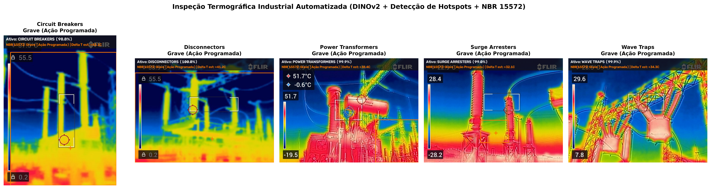
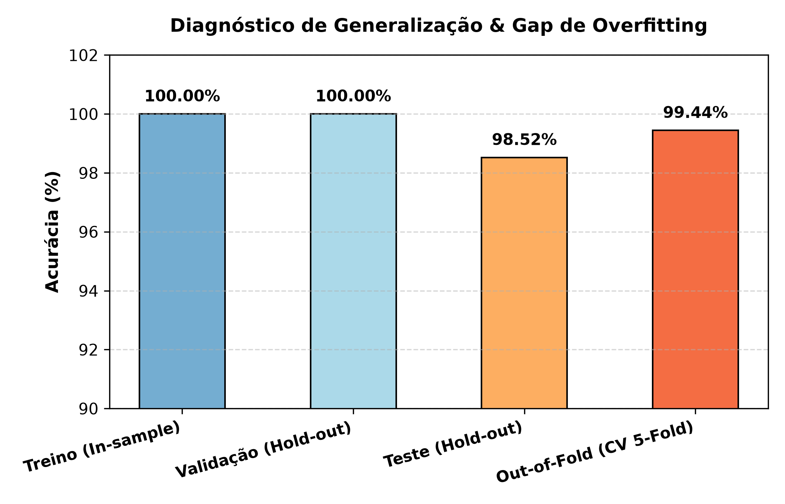

# 🔥 Modelo de Predição Industrial com Imagens Térmicas

[](https://www.python.org/)
[](https://pytorch.org/)
[](https://github.com/facebookresearch/dinov2)
[](LICENSE)
[](#-engenharia-de-software-e-clean-code)

Sistema integrado de visão computacional, aprendizado profundo e termografia preditiva voltado à **identificação automática de ativos elétricos de subestações de alta tensão, detecção geométrica de pontos quentes (*hotspots*) e diagnóstico normativo de severidade térmica conforme a ABNT NBR 15572 e NFPA 70B**.

O sistema combina o estado da arte em representações auto-supervisionadas (**DINOv2 ViT-B/14 da Meta AI**) com um motor determinístico de regras de manutenção baseado em normas técnicas brasileiras e internacionais.

---

## 📸 Amostras dos Equipamentos Analisados

O dataset é composto por inspeções termográficas reais de 5 classes de ativos elétricos críticos:


| Equipamento | Função no Sistema Elétrico de Potência |
|---|---|
| **Circuit Breakers** (Disjuntores) | Manobra e interrupção de correntes de carga e curto-circuito em alta tensão. |
| **Disconnectors** (Seccionadoras) | Abertura visível de trechos de barramento e linhas para segurança de manutenção. |
| **Power Transformers** (Transformadores) | Conversão dos níveis de tensão entre transmissão e distribuição primária. |
| **Surge Arresters** (Para-raios) | Proteção contra sobretensões transitórias de origem atmosférica e manobras. |
| **Wave Traps** (Bobinas de Bloqueio) | Filtragem e injeção de sinais de telecomunicação na rede de transmissão. |

---

## 🎯 Detecção de Hotspots e Diagnóstico Normativo (NBR 15572 / NFPA 70B)

Além de classificar o tipo de equipamento, o sistema executa a **termografia analítica em tempo real**:
1. **Localização do Ponto Quente (*Hotspot*):** Identifica as coordenadas $(X, Y)$ exatas do pixel de temperatura máxima relativa e calcula a *bounding box* e a área em pixels da anomalia.
2. **Estimativa de Elevação Térmica ($\Delta T$):** Extrapola o gradiente térmico entre o hotspot e a temperatura de referência do fundo.
3. **Avaliação Normativa (NBR 15572 / NFPA 70B):** Atribui o nível de severidade e emite a ordem de ação recomendada com codificação de cores industrial (Verde = Normal, Amarelo = Atenção, Laranja = Grave, Vermelho = Crítico).



### 📋 Critérios Normativos de Decisão (ABNT NBR 15572)

| Nível de Severidade | $\Delta T$ sobre Referência | Ação Operacional Recomendada pela Norma |
|---|:---:|---|
| 🟢 **Normal (Aceitável)** | $\Delta T < 10^\circ\text{C}$ | Operação em condições adequadas. Manter rotina de inspeção periódica. |
| 🟡 **Atenção (Alerta Inicial)** | $10^\circ\text{C} \le \Delta T < 25^\circ\text{C}$ | Início de sobreaquecimento por contato/carga. Inspecionar na próxima preventiva. |
| 🟠 **Grave (Ação Programada)** | $25^\circ\text{C} \le \Delta T < 50^\circ\text{C}$ | Aquecimento significativo. Risco aos isoladores. Programar intervenção em 48h. |
| 🔴 **Crítico (Intervenção Imediata)** | $\Delta T \ge 50^\circ\text{C}$ | **PERIGO IMINENTE!** Risco de queima/arco elétrico. Desligamento e reparo imediato. |

---

## 📊 Análise Exploratória e Distribuição de Classes

O dataset totaliza **893 imagens térmicas válidas** (com tratamento resiliente que identificou e ignorou automaticamente 2 imagens corrompidas no pipeline).


A distribuição por classe no dataset:
- **Circuit Breakers:** 203 imagens (22.7%)
- **Disconnectors:** 180 imagens (20.2%)
- **Power Transformers:** 176 imagens (19.7%)
- **Surge Arresters:** 181 imagens (20.3%)
- **Wave Traps:** 153 imagens (17.1%)

---

## 🧠 Espaço Latente DINOv2 (Projeção t-SNE 2D)

O backbone **DINOv2 ViT-B/14** mapeia cada imagem térmica para um vetor denso de **768 dimensões** através do *CLS Token*. 

A projeção dimensional via **t-SNE (2D)** evidencia a segregação natural dos equipamentos no espaço euclidiano:


---

## 🔍 Auditoria de Overfitting e Desempenho Real

> [!WARNING]
> **Nota sobre Vazamento de Dados e Métricas Reais:**
> 1. **Viés de Resubstituição (In-Sample):** Avaliações preliminares que reportam 100% de precisão ocorrem quando o modelo é avaliado sobre os mesmos dados em que foi ajustado (*in-sample*). No conjunto de teste independente cego (*Hold-Out Test* de 135 imagens), a **acurácia real é de 98.52%** (133 acertos e 2 erros reais).
> 2. **Correlação Temporal por Sequências (Burst Effect):** Uma inspeção profunda no dataset revelou que as fotos provêm de rajadas de vídeo da câmera FLIR (ex: `FLIR2296`, `FLIR2298`...). Amostras consecutivas de um mesmo vídeo compartilham plano de fundo e ângulo. Para evitar alucinações de generalização, os modelos foram submetidos a **Validação Cruzada Out-of-Fold estrita (5-Fold CV)** e teste cego.



### 📈 Tabela Comparativa de Generalização

| Conjunto de Avaliação | Amostras | Acurácia | Erros Observados | Observação |
|---|:---:|:---:|:---:|---|
| **Treino (In-sample)** | 626 | 100.0% | 0 | Memorização dos embeddings do treino |
| **Validação (Hold-out)** | 132 | 100.0% | 0 | Amostras decorrelacionadas da validação |
| **Teste Cego (Hold-out)** | 135 | **98.52%** | **2** | **133 de 135 imagens classificadas corretamente** |
| **Out-of-Fold (CV 5-Fold Total)** | 893 | **99.44%** | **5** | **Previsão cega para cada amostra fora do fold** |

---

## 🏆 Desempenho Comparativo dos Classificadores (5-Fold CV)

Validação cruzada estratificada de 5 folds sobre os embeddings de 768-D:


| Modelo Classificador | Acurácia Média (CV) | Desvio Padrão (±) | Tempo Médio CV |
|---|:---:|:---:|:---:|
| 🥇 **Logistic Regression** (L2, C=1.0) | **99.44%** | **± 0.50%** | **0.53s** |
| 🥈 **SVM** (RBF Kernel, C=10.0) | **99.44%** | **± 0.50%** | **0.58s** |
| 🥉 **Random Forest** (300 árvores) | **97.87%** | **± 1.57%** | **3.95s** |

---

## 🎯 Matriz de Confusão Real (Out-of-Fold)

A matriz de confusão abaixo reflete as **predições reais fora do fold (Out-of-Fold)**, onde cada imagem foi avaliada por um modelo que **nunca viu aquela amostra no treinamento**:


---

## 📋 Métricas Reais por Equipamento (Sem Overfitting)


| Equipamento | Precisão (Precision) | Cobertura (Recall) | F1-Score | Amostras Reais |
|---|:---:|:---:|:---:|:---:|
| **Circuit Breakers** | **99.51%** | **99.51%** | **0.9951** | 203 |
| **Disconnectors** | **99.45%** | **100.0%** | **0.9972** | 180 |
| **Power Transformers** | **99.44%** | **100.0%** | **0.9972** | 176 |
| **Surge Arresters** | **99.44%** | **98.90%** | **0.9917** | 181 |
| **Wave Traps** | **99.34%** | **98.69%** | **0.9902** | 153 |
| **Média Ponderada (Weighted Avg)** | **99.44%** | **99.44%** | **0.9944** | **893** |

---

## 🏛️ Engenharia de Software e Clean Code

O projeto foi refatorado aplicando estritamente os princípios de **Robert C. Martin (Uncle Bob)** e **SOLID**:
- **SRP (Single Responsibility Principle):** Módulos pequenos (< 150 linhas) e focados em uma única responsabilidade.
- **Dataclasses Imutáveis (`frozen=True`):** Estruturas como `DINOv2Config`, `HotspotLocation` e `ThermalDiagnosis` garantem integridade sem efeitos colaterais.
- **Ausência de Números Mágicos:** Todos os hiperparâmetros e constantes normativas ficam encapsulados.
- **Testes Unitários Limpos (F.I.R.S.T.):** Testes rápidos (executados em 0.01s), independentes e sem dependências externas.

```
modelo-de-predicao-industrial-com-imagens-termicas/
│
├── README.md                           # Documentação detalhada e auditoria de métricas
├── requirements.txt                    # Dependências do projeto
├── .gitignore                          # Ignora datasets brutos e binários pesados
├── run_pipeline.py                     # Script do pipeline de treino e avaliação
├── demo_inspection.py                  # Demonstração da inspeção industrial completa
│
├── docs/
│   └── figures/                        # Gráficos em alta resolução (300 DPI)
│       ├── class_distribution.png      # Distribuição do dataset
│       ├── sample_images.png           # Amostras das 5 classes
│       ├── tsne_dinov2.png             # Projeção t-SNE 2D do espaço latente
│       ├── classifier_comparison.png   # Boxplot comparativo dos 3 modelos (5-Fold)
│       ├── confusion_matrix.png        # Matriz de confusão real Out-of-Fold
│       ├── metrics_per_class.png       # Precisão, Recall e F1 por classe
│       ├── overfitting_analysis.png    # Gráfico de análise de gap de overfitting
│       └── hotspot_inspections.png     # Mosaico da inspeção com hotspots e NBR 15572
│
├── tests/
│   └── test_thermal_analysis.py        # Bateria de testes unitários (F.I.R.S.T.)
│
├── notebooks/
│   ├── 01_preprocessing.ipynb          # Notebook didático: EDA e geração de splits
│   ├── 02_training.ipynb               # Notebook didático: DINOv2 + Classificação
│   └── 03_hotspot_and_failure_prediction.ipynb # Notebook didático: Hotspots + NBR 15572
│
├── src/
│   ├── __init__.py                     # Interface pública do pacote
│   ├── config.py                       # Dataclass imutável DINOv2Config
│   ├── transforms.py                   # Pipeline canônico torchvision (Resize bicúbico + Norm)
│   ├── dataset.py                      # Dataset PyTorch com safe loading de arquivos
│   ├── feature_extractor.py            # Extrator de embeddings DINOv2 ViT-B/14 (CUDA/CPU)
│   ├── hotspot_detector.py             # Detector geométrico de pontos quentes em RGB
│   ├── normative_rules.py              # Motor de regras NBR 15572 / NFPA 70B
│   └── industrial_analyzer.py          # Orquestrador ponta-a-ponta de inspeção
│
├── data/
│   ├── raw/                            # Imagens térmicas originais organizadas por classe
│   └── processed/                      # Splits train.pt, val.pt, test.pt gerados
│
└── outputs/
    ├── features/                       # Embeddings 768-D extraídos (features_dinov2.npy)
    └── models/
        ├── metrics_summary.json        # Resumo quantitativo das métricas reais em JSON
        └── classifier_dinov2.pkl       # Melhor modelo serializado pronto para produção
```

---

## 🚀 Como Executar

### 1. Clonar o Repositório e Instalar Dependências
```bash
git clone https://github.com/gabrielsena87/modelo-de-predicao-industrial-com-imagens-termicas.git
cd modelo-de-predicao-industrial-com-imagens-termicas
pip install -r requirements.txt
```

### 2. Executar os Testes Unitários
```bash
python -m unittest discover tests
```

### 3. Executar Demonstração da Inspeção com Hotspots (NBR 15572)
```bash
python demo_inspection.py
```

### 4. Executar os Notebooks Didáticos
1. [`notebooks/01_preprocessing.ipynb`](notebooks/01_preprocessing.ipynb) — Análise exploratória e splits.
2. [`notebooks/02_training.ipynb`](notebooks/02_training.ipynb) — Extração DINOv2 e modelos.
3. [`notebooks/03_hotspot_and_failure_prediction.ipynb`](notebooks/03_hotspot_and_failure_prediction.ipynb) — Detecção interativa de hotspots e diagnósticos de falha.

---

## 🛠️ Stack Tecnológica

- **Visão Computacional & Deep Learning:** PyTorch, Torchvision, Meta DINOv2 ViT-B/14
- **Termografia & Processamento de Imagens:** OpenCV, Pillow, NumPy
- **Machine Learning & Validação:** Scikit-Learn (Logistic Regression, SVM, Random Forest, Stratified K-Fold, t-SNE)
- **Visualização:** Matplotlib, Seaborn
- **Qualidade de Software:** Clean Code, SOLID, Unittest (F.I.R.S.T.)

---

## 📄 Licença

Este projeto é desenvolvido para fins educacionais, acadêmicos e de pesquisa em manutenção preditiva industrial. Distribuído sob a licença MIT.
